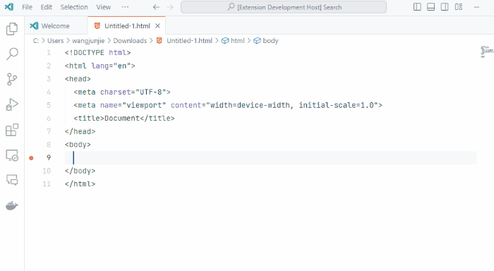
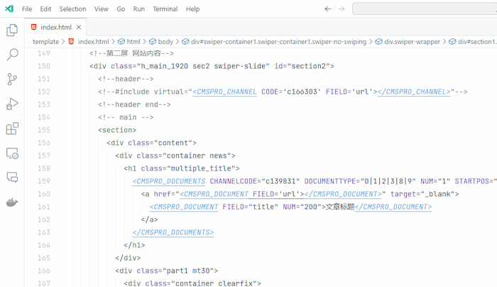

# Kaipu Platform Snippets for VS Code

集约化平台代码补全、高亮插件。 

直接输入集约化平台标签就会产生提示。

> eg: documents

## Snippets

| 说明               | 输入关键词                      | 生成的片段                                                                                                                                                                                        |
|------------------- |-------------------------------|----------------------------------------------------------------------------------------------------------------------------------------------------------------------------------------------|
|站点数据             | website                       | \<CMSPRO_WEBSITE FIELD=''></CMSPRO_WEBSITE>                                                                                                                                                   |
|栏目                | channels                      | \<CMSPRO_CHANNELS CODE="" CHILDLEVEL="" CHILDTYPE="0\|1\|2\|3" NUM="" STARTPOS=""></CMSPRO_CHANNELS>                                                                                          |
|栏目链接             | channel_url                   | \<CMSPRO_CHANNEL CODE='' FIELD='url'></CMSPRO_CHANNEL>                                                                                                                                    |
|栏目名称             | channel_channelName           | \<CMSPRO_CHANNEL CODE='' FIELD='channelName'></CMSPRO_CHANNEL>                                                                                                                            |
|循环列表             | documents                     | \<CMSPRO_DOCUMENTS CHANNELCODE="" DOCUMENTTYPE="0\|1\|2\|3\|8\|9" NUM="" STARTPOS="0"></CMSPRO_DOCUMENTS>                                                                          |
|循环列表带分页        | documents                     | \<CMSPRO_DOCUMENTS CHANNELCODE="" DOCUMENTTYPE="0\|1\|2\|3\|8\|9" NUM="1000" PAGESIZE="" STARTPOS="0" PAGENAVIGATIONID="page-div" PAGENAVIGATIONCLASS=""></CMSPRO_DOCUMENTS> |
|图片资源             | appendixs                     | \<CMSPRO_APPENDIXS MODE="IMG" NUM="1" STARTPOS="0">\</CMSPRO_APPENDIX>" alt="" /></CMSPRO_APPENDIXS>                                         |
|图片资源路径          | appendix                      | \<CMSPRO_APPENDIX FIELD='path'></CMSPRO_APPENDIX>                                                                                                                                             |
|文章链接             | document url                  | \<CMSPRO_DOCUMENT FIELD='url'></CMSPRO_DOCUMENT>                                                                                                                                              |
|文章标题             | document title                | \<CMSPRO_DOCUMENT FIELD="title">文章标题</CMSPRO_DOCUMENT>                                                                                                                                      |
|文章内容             | document content              | \<CMSPRO_DOCUMENT FIELD="content">文章内容</CMSPRO_DOCUMENT>                                                                                                                                    |
|文章发布日期 年月日时分（24小时制）| document publishedTime        | \<CMSPRO_DOCUMENT FIELD="publishedTime" DATEFORMAT="yyyy-MM-dd HH:mm">日期+时间</CMSPRO_DOCUMENT>                                                                                             |
|文章发布日期 年月日    | document publishedTime        | \<CMSPRO_DOCUMENT FIELD="publishedTime" DATEFORMAT="yyyy-MM-dd">日期</CMSPRO_DOCUMENT>                                                                                                      |
|元数据              | document meta                 | \<CMSPRO_DOCUMENT FIELD="" DOMAINMETADATANAME="默认元数据集"></CMSPRO_DOCUMENT>                                                                                                         |
|面包屑导航（使用 > 分割）| location                      | <CMSPRO_LOCATION LINK="&nbsp;&gt;&nbsp;" SELFONLY="false" AUTOLINK="true" TARGET="_blank" LINKEXTRA="" HOMEPAGEDESC="首页">当前位置</CMSPRO_LOCATION>                                  |
|引用模板              | include                       | \<!--#include virtual="<CMSPRO_CHANNEL CODE='' FIELD='url'></CMSPRO_CHANNEL>"-->                                                                                                              |
|引用页头模板（注释不同）| include_header                | \<!--#include virtual="<CMSPRO_CHANNEL CODE='' FIELD='url'></CMSPRO_CHANNEL>"-->                                                                                                              |
|引用页脚模板（注释不同）| include_footer                | \<!--#include virtual="<CMSPRO_CHANNEL CODE='' FIELD='url'></CMSPRO_CHANNEL>"-->                                                                                                              |

## 高亮显示标签

---

**Enjoy!**
